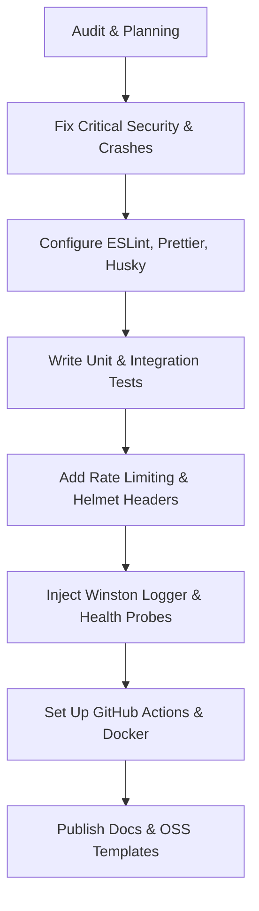

# Repository Production-Readiness Audit Report

This report presents a thorough, professional evaluation of the collaborative sandbox codebase (frontend and backend) to assess its fitness for production deployment.

---

## Executive Summary

The project is a collaborative development environment (Whisper Sandbox) featuring real-time socket updates, file tree synchronization, and an LLM-assisted workspace. While the frontend user interface has been refactored for professional usability, the backend architecture and devops pipeline remain in a "developer project" state.

We identified several **critical security vulnerabilities** (unprotected routes, CORS wildcards) and **reliability issues** (uncaught process crashes) that act as strict production blockers. Remediation across all 12 defined phases is required before this repository can meet open-source and production-grade standards.

---

## Architecture Findings

The codebase uses a split architecture:

1. **Frontend**: Vite-based React single-page application communicating via Axios and Socket.io.
2. **Backend**: Express-based REST API and Socket.io server using MongoDB (via Mongoose) and Redis (for token blacklisting).

### Architectural Strengths:

- **Clean modular split** between Express routes, controllers, services, and schemas.
- **Dynamic Socket namespace/rooms** separation aligned with projects.
- **Fail-safe fallback in Redis service** that defaults to memory storage if Redis is down, preserving application functionality.

### Key Architectural Flaws:

- **Redundant Database Queries**: The JWT authentication token signs only the user's `email`. As a result, every authenticated request must hit `userModel.findOne({ email })` to find the user's `_id` before performing project database operations.
- **Tight Socket Coupling**: Socket middleware loads the entire project structure in memory via Mongoose (`socket.project = await projectModel.findById(projectId)`), caching it in the socket instance, which could lead to high RAM consumption with large numbers of users.
- **Undefined Global Error Handlers**: Missing central Express error-handling middleware, leading to raw stack trace leakages to API users.

---

## Production & Security Blockers

### 🚨 Critical Risks & Security Blockers

#### 1. Unchecked Project ID Process Crash (`server.js` - Severity: Critical)

- **Finding**: In `server.js` (Socket middleware), if an invalid or non-existent `projectId` is passed, `projectModel.findById(projectId)` resolves to `null`. However, line 60 immediately references `socket.project._id.toString()`.
- **Impact**: This throws an unhandled `TypeError` inside the Socket.io connection callback, crashing the entire Node.js server process and disconnecting all other connected users.

#### 2. Project Route Authorization Leak (`project.controller.js` - Severity: Critical)

- **Finding**: The routes `/projects/get-project/:projectId` and `/projects/update-file-tree` utilize `authMiddleWare.authUser`, verifying that the requesting user is _logged in_. However, they **do not** check if the logged-in user is a member of the project being requested or edited.
- **Impact**: Any registered user can access, read, or overwrite the file trees of _any_ project on the server by simply guessing or iterating the MongoDB `projectId`.

#### 3. Unprotected AI Endpoint (`ai.routes.js` - Severity: High)

- **Finding**: The endpoint `/ai/get-result` has no authentication middleware applied.
- **Impact**: Anyone on the internet can call this route, incurring significant billing charges on your Google Generative AI API account.

#### 4. CORS Permissive Wildcard (`app.js` and `server.js` - Severity: High)

- **Finding**: Express CORS is initialized with `app.use(cors())` and Socket.io uses `cors: { origin: '*' }`.
- **Impact**: Allows malicious third-party websites to make API calls and establish socket handshakes on behalf of logged-in users.

#### 5. Safe Split authorization crash (`auth.middleware.js` - Severity: Medium)

- **Finding**: `req.headers.authorization.split(' ')[1]` is invoked without checking if `req.headers.authorization` is defined.
- **Impact**: Will throw a crash error if an unauthorized user hits the routes without an `Authorization` header and without cookie context.

---

## Open-Source (OSS) & DevOps Blockers

1. **Zero Test Coverage**: No unit, integration, or automated tests are implemented in the entire project.
2. **Missing Quality Enforcement**: No linters (ESLint), formatters (Prettier), or pre-commit hooks (Husky, Lint-staged) are configured, allowing style drift and syntax errors to bypass local commits.
3. **No Environment Validation**: The application starts silently without verifying if required secrets (`GOOGLE_AI_KEY`, `JWT_SECRET`, `MONGODB_URI`) are present in `.env`, resulting in confusing runtime failures.
4. **Console Logging**: Application logs rely entirely on `console.log` and `console.error` without logging levels, timestamp headers, or structured formats (JSON).
5. **No CI/CD Workflows**: Missing automated test run, lint checker, and release pipelines.
6. **No Docker Setup**: Missing a production-grade multi-stage container configuration.

---

## Recommended Remediation Plan

### Phase A: Core Hardening & Security (Immediate)

- Fix the Socket.io null project check in `server.js`.
- Add membership checks to `getProjectById` and `updateFileTree` in `project.service.js`.
- Add `authUser` middleware check to `/ai/get-result`.
- Enforce token format checks in `auth.middleware.js`.
- Refactor User JWT payload to include `_id` so we avoid hitting MongoDB on every auth verification hook.

### Phase B: Environment & Code Quality (DX)

- Install Zod for environment validation in both `backend` and `frontend`.
- Expose configurations for Prettier, ESLint, EditorConfig, Husky, and Lint-Staged.
- Enforce Conventional Commits validation.

### Phase C: Testing & CI/CD

- Set up **Vitest** for testing backend routes/controllers and frontend components.
- Configure GitHub Actions to automate code validation (`ci.yml`), release versioning (`release.yml`), and security auditing (`security.yml`).

### Phase D: Production Container & Documentation

- Build production multi-stage Dockerfiles.
- Generate standard OSS documents (`LICENSE`, templates) and deep-dive technical documents in `/docs/`.
