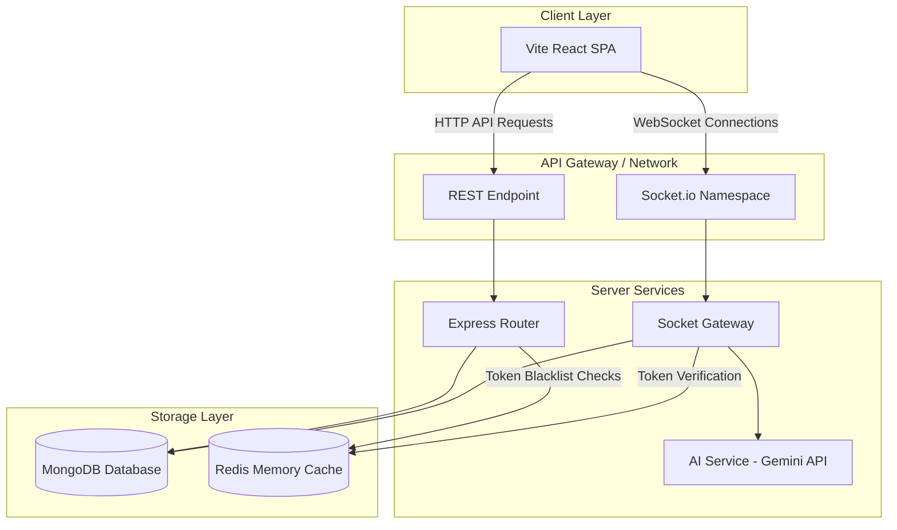
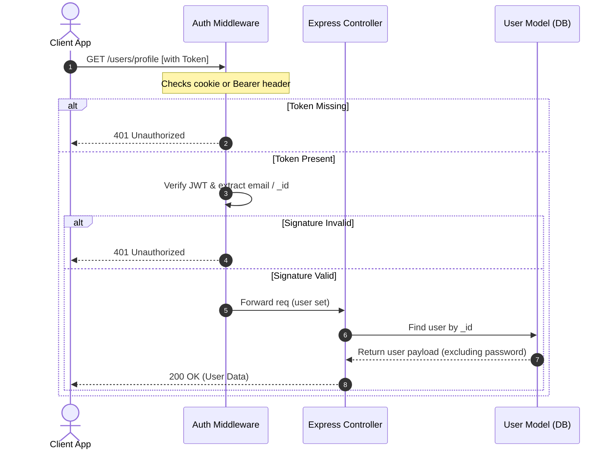
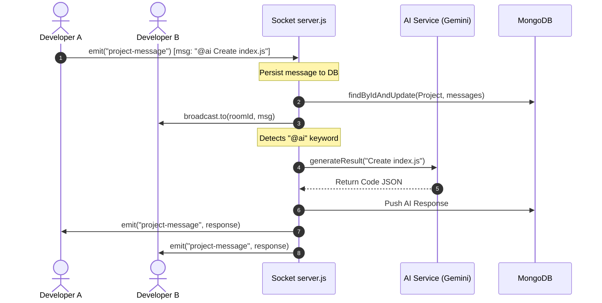
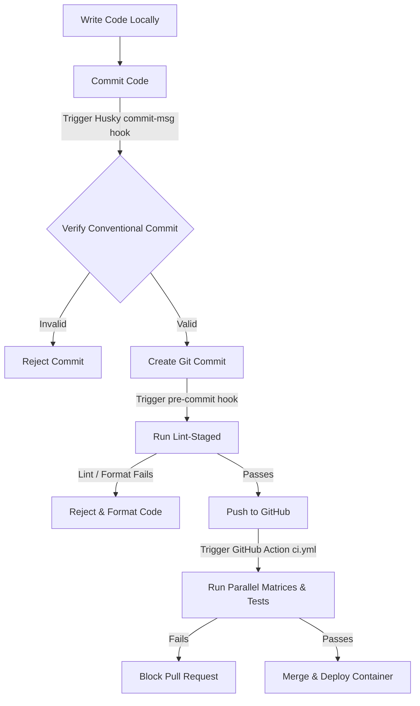

# System Architecture & Diagrams

This document details the system design, communication protocols, request lifecycles, and security boundaries of the collaborative sandbox environment.

---

## 🏗️ High-Level System Architecture

The sandbox uses a decoupled, event-driven architecture to facilitate real-time code collaboration and AI generation.



---

## 🚦 Request & Data Lifecycles

### 1. HTTP REST Authentication Lifecycle

Below is the sequence of auth verification and header mapping when accessing secured API routes:



### 2. Sockets Real-Time Synchronization Flow

Real-time message routing and AI prompt triggers flow dynamically through project rooms:



---

## 🛡️ Security Boundaries

We isolate operational layers to block arbitrary access:

```mermaid
graph LR
    subgraph Public Internet
        A[Client Browser]
    end

    subgraph Secure Perimeter (Perimeter Firewall)
        B[Express App Router]
        C[Socket Server]
    end

    subgraph Internal Network (No External Access)
        D[(MongoDB Cluster)]
        E[(Redis Instance)]
        F[Google Gemini API Gateway]
    end

    A -->|REST API over SSL| B
    A -->|WSS Sockets| C
    B -->|Mongoose connection| D
    C -->|Mongoose connection| D
    B -->|Caching| E
    C -->|AI Queries| F
```

---

## 💻 Developer Workflow

The lifecycle of developer updates from local editor to production repository:


